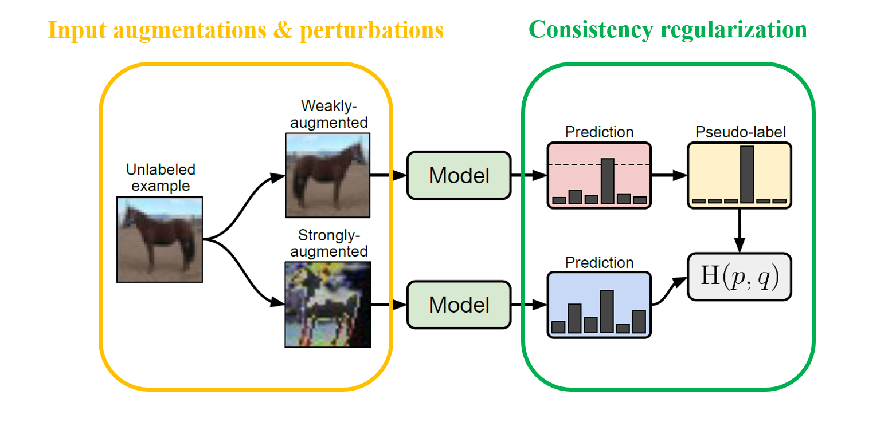
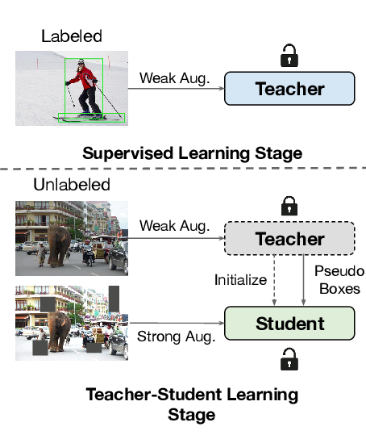

# Semi-Supervised Training for Detection of Personal-Protective-Equipment (PPE)

## Problem

We explained in detail at this [repository](https://github.com/thainguyentrong/gfl-ppe). You need watch it before reading on.

## Our implementation

### Semi-Supervised Training



The availability of large-scale datasets and computational resources has allowed deep neural networks to achieve strong performance on a wide variety of tasks. However, training these networks requires a large number of labeled examples that are expensive to annotate and acquire. As an alternative, Semi-Supervised Learning methods have received growing attention. Yet, these advances have primarily focused on image classification, rather than object detection where bounding box annotations require more effort.

### Overall impression



The nature of class-imbalance in object detection tasks impedes the usage of pseudo-labeling. Also, object detectors are far more complicated than image classifiers in terms of model architectures.

This [article](https://arxiv.org/abs/2102.09480) proposed an approach that jointly trains a Student and a slowly progressing Teacher in a mutually-beneficial manner, in which the Teacher generates pseudo-labels to train the Student, while the Teacher and the Student are given different augmented input images.

## Results

## Citation

```
@article{Liu2021UnbiasedTF,
  title={Unbiased Teacher for Semi-Supervised Object Detection},
  author={Yen-Cheng Liu and Chih-Yao Ma and Zijian He and Chia-Wen Kuo and Kan Chen and Peizhao Zhang and Bichen Wu and Zsolt Kira and P{\'e}ter Vajda},
  journal={ArXiv},
  year={2021},
  volume={abs/2102.09480}
}
```
